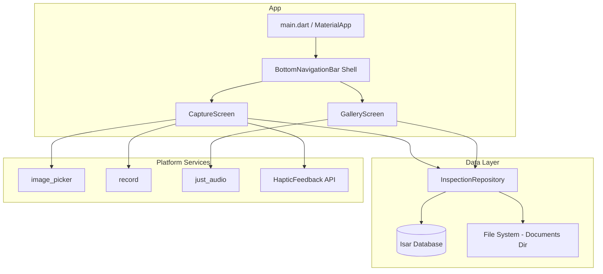
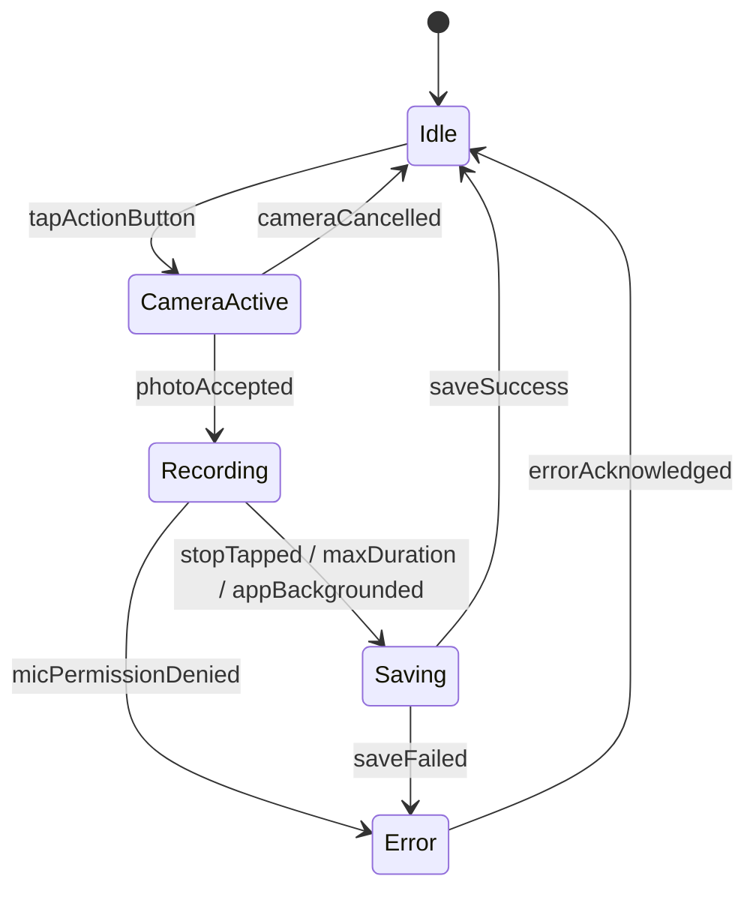

# Design Document: Initial MVP

## Overview

Project Osprey is a local-first iOS voice-capture inspection app built with Flutter. The MVP provides a two-screen flow: a Capture Screen for the photo-then-voice workflow, and a Gallery Screen for reviewing captured inspections. The app uses a state-machine-driven capture flow with haptic feedback at each transition, enabling eyes-free operation. All data stays on-device using Isar for metadata and the iOS Documents Directory for media files.

### Key Design Decisions

1. **State machine for capture flow**: A finite state machine governs the capture workflow (idle → camera → recording → saving → idle), ensuring deterministic transitions and preventing invalid states.
2. **setState for state management**: Each screen manages its own state via `setState` and a simple enum. No external state management library for MVP simplicity.
3. **`record` package for audio**: Uses AVAudioRecorder natively on iOS, supports m4a output directly, simple API.
4. **`just_audio` for playback**: Supports file playback with position streams needed for elapsed-time display.
5. **Timestamp-based filenames**: Media files use UTC timestamp format `yyyyMMdd_HHmmss` plus a millisecond suffix for uniqueness, matching requirements. The Isar record stores the same timestamp for display.

## Architecture

### High-Level Architecture



### Capture Flow State Machine



## Components and Interfaces

### CaptureScreen (`lib/screens/capture_screen.dart`)

Drives the photo→voice capture workflow via a state machine.

```dart
enum CaptureState { idle, cameraActive, recording, saving, error }
```

- Large centered action button (≥40% screen width, centered in middle 60% of height)
- Recording indicator + stop button visible only during recording
- Transitions trigger haptic feedback at each state change
- 5-minute max recording duration with auto-stop
- App lifecycle handling: auto-stop recording on background

### GalleryScreen (`lib/screens/gallery_screen.dart`)

Displays all InspectionItems in a scrollable feed with inline audio playback.

- Loads items from repository, ordered by `createdAt` descending
- Single `AudioPlayer` instance for exclusive playback
- 80x80 thumbnail, timestamp label, play/pause button with elapsed time
- Empty state message when zero items
- Graceful degradation for missing files (placeholder image, disabled play button)

### InspectionRepository (`lib/services/inspection_repository.dart`)

Coordinates Isar database writes and file system operations.

```dart
class InspectionRepository {
  Future<void> init();
  Future<void> saveInspection({required String photoPath, required String audioPath});
  Future<List<InspectionItem>> getAllItems(); // ordered by createdAt desc
  Future<void> deleteInspection(int id);
}
```

**Invariants**:
- An InspectionItem is only written to Isar after both media files exist on disk.
- If file write fails, no Isar record is created.
- If Isar write fails, media files are retained on disk.

### HapticService (`lib/services/haptic_service.dart`)

```dart
class HapticService {
  static void medium();   // camera activated
  static void heavy();    // recording started
  static void success();  // save complete
  static void error();    // save failed
}
```

All methods are fire-and-forget; exceptions are swallowed silently.

## Data Models

### Isar Schema: InspectionItem

```dart
@collection
class InspectionItem {
  Id id = Isar.autoIncrement;
  late String photoFileName;   // e.g. "20250621_143052_123.jpg"
  late String audioFileName;   // e.g. "20250621_143052_123.m4a"
  late DateTime createdAt;
}
```

- Filenames are relative to Documents Directory (full path resolved at runtime via `path_provider`).
- `createdAt` indexed for descending sort.
- No nullable fields — an InspectionItem always has both photo and audio.

### File Storage Layout

```
<iOS Documents Directory>/
├── photos/
│   ├── 20250621_143052_123.jpg
│   └── ...
└── audio/
    ├── 20250621_143052_123.m4a
    └── ...
```

Filename format: `yyyyMMdd_HHmmss_SSS` (UTC timestamp + milliseconds for uniqueness).

## Error Handling

| Error | User-Facing Message | Recovery |
|-------|-------------------|----------|
| Photo save fails | "Photo could not be saved" | Return to idle, no InspectionItem |
| Audio save fails | "Voice memo could not be saved" | Discard incomplete item |
| Isar write fails | "Record could not be saved" | Retain media files, show error |
| Microphone denied | System permission dialog | Block until granted |
| Audio file missing | Disable Play, show indicator | Card shows error state |
| Photo file missing | Placeholder thumbnail | Gallery remains scrollable |
| Haptic unavailable | (silent) | Continue without haptics |

## Testing Strategy

### Widget Tests (standard `flutter_test`)

- Action button sizing and positioning
- Bottom nav bar structure (2 tabs, icons, labels, default tab)
- Recording indicator visibility tied to state
- Empty gallery state message
- Thumbnail dimensions (80x80)

### Unit Tests

- HapticService: correct channel methods called, exceptions swallowed
- InspectionRepository: save produces files + record, failures don't leave orphans
- Gallery ordering: items returned in descending createdAt order

### Integration Tests (on iOS simulator)

- Full capture flow: tap → camera → photo → recording → stop → verify in gallery
- Permission denial and grant flow
- Background transition during recording
- Persistence across app relaunch
