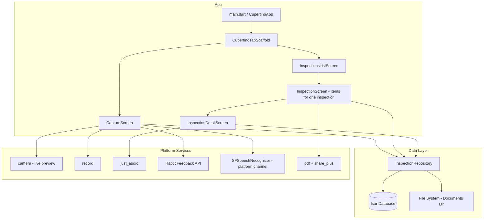
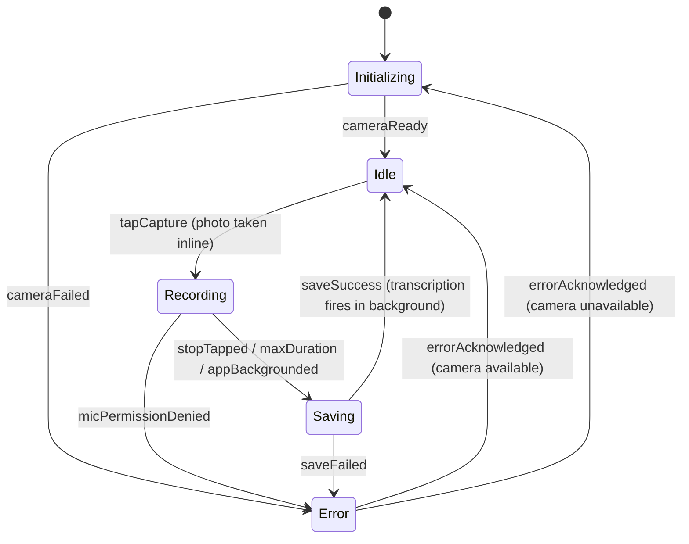

# Design Document: Initial MVP

## Overview

Project Osprey is a local-first iOS voice-capture inspection app for commercial roofing contractors, built with Flutter using Cupertino design. The MVP provides a two-tab flow: a Capture Screen with live camera preview for the photo-then-voice workflow, and an Inspection Screen for reviewing items with automatic on-device transcription. Items can be viewed in detail or exported as a PDF report. All data stays on-device using Isar for metadata and the iOS Documents Directory for media files.

### Key Design Decisions

1. **State machine for capture flow**: A finite state machine governs the capture workflow (initializing → idle → recording → saving → idle), ensuring deterministic transitions and preventing invalid states.
2. **Cupertino design**: iOS-native look and feel throughout — `CupertinoApp`, `CupertinoTabScaffold`, `CupertinoNavigationBar`, `CupertinoAlertDialog`. Appropriate for an iOS-only field app.
3. **setState for state management**: Each screen manages its own state via `setState` and a simple enum. No external state management library for MVP simplicity.
4. **Live camera preview**: Uses the `camera` package for an always-visible preview. Photos are taken inline without switching apps.
5. **`record` package for audio**: Uses AVAudioRecorder natively on iOS, supports m4a output directly.
6. **`just_audio` for playback**: Supports file playback with position/duration streams for the detail screen player.
7. **On-device speech transcription**: Platform channel to iOS `SFSpeechRecognizer` with `SFSpeechURLRecognitionRequest`. Runs in background after save, retries pending on app launch.
8. **Timestamp-based filenames**: `yyyyMMdd_HHmmss_SSS` (UTC + milliseconds) for uniqueness.
9. **PDF export**: `pdf` package generates A4 report, `share_plus` opens iOS share sheet.

## Architecture

### High-Level Architecture



### Capture Flow State Machine



## Components and Interfaces

### CaptureScreen (`lib/screens/capture_screen.dart`)

Drives the photo→voice capture workflow via a state machine. Shows a live camera preview as the full-screen background.

```dart
enum CaptureState { initializing, idle, recording, saving, error }
```

- Full-screen live camera preview (CameraPreview widget) as background
- Camera initializes on start (cameras list passed from main), reinitializes on app resume
- Mic permission pre-checked at camera init time
- Capture button overlaid at bottom center — tapping takes photo inline then starts audio recording
- Photo capture and UI transition happen before recorder starts (avoids capturing shutter sound)
- Recording indicator + stop button visible only during recording
- Haptic feedback at each state transition
- 5-minute max recording duration with auto-stop
- App lifecycle: auto-stop recording on background, reinit camera on resume
- After save: fire-and-forget transcription via TranscriptionService

### InspectionsListScreen (`lib/screens/inspections_list_screen.dart`)

Root screen of the Inspections tab. Shows all inspections.

- List of inspections ordered by createdAt descending
- Each row: name, item count, date
- "New Inspection" button in nav bar → prompts for name via CupertinoAlertDialog with text field
- Tap inspection → navigates to InspectionScreen (scoped to that inspection)
- Swipe-left to delete entire inspection (with confirmation)
- Tracks active inspection ID (passed to CaptureScreen)

### InspectionScreen (`lib/screens/inspection_screen.dart`)

Displays all InspectionItems in a scrollable feed with transcript previews.

- Loads items from repository, ordered by `createdAt` descending
- 64x64 thumbnail + timestamp + transcript preview (2 lines, or "Transcribing..." italic)
- Tap item → navigates to InspectionDetailScreen
- Swipe left to delete (Dismissible) with confirmation dialog
- Share button in nav bar → generates PDF and opens share sheet (with loading indicator)
- Pull-to-refresh via CupertinoSliverRefreshControl
- Empty state message when zero items

### InspectionDetailScreen (`lib/screens/inspection_detail_screen.dart`)

Full detail view of a single inspection item.

- Full-size photo
- Audio player: play/pause button, progress bar, elapsed/total time display
- Complete transcript text (scrollable)
- Graceful handling of missing files

### InspectionRepository (`lib/services/inspection_repository.dart`)

Coordinates Isar database writes and file system operations.

```dart
class InspectionRepository {
  Future<void> init();
  Future<int> saveInspection({required String photoPath, required String audioPath});
  Future<List<InspectionItem>> getAllItems();
  Future<List<InspectionItem>> getItemsWithoutTranscript();
  Future<void> updateTranscript(int id, String transcript);
  Future<void> deleteInspection(int id);
  String getPhotoPath(InspectionItem item);
  String getAudioPath(InspectionItem item);
}
```

### TranscriptionService (`lib/services/transcription_service.dart`)

Platform channel wrapper for iOS SFSpeechRecognizer.

```dart
class TranscriptionService {
  static Future<String?> transcribe(String audioFilePath);
}
```

- Channel: `osprey/transcription`, method: `transcribe`
- Native side: `SFSpeechURLRecognitionRequest` with `requiresOnDeviceRecognition = true`
- Returns null on any failure

### PdfExportService (`lib/services/pdf_export_service.dart`)

Generates PDF inspection report and triggers iOS share sheet.

```dart
class PdfExportService {
  static Future<void> exportAndShare({
    required List<InspectionItem> items,
    required InspectionRepository repository,
  });
}
```

- A4 format, multi-page
- Each item: timestamp, embedded photo, transcript text, divider
- Saves to temp directory, shares via `Share.shareXFiles`

### HapticService (`lib/services/haptic_service.dart`)

```dart
class HapticService {
  static void medium();   // capture tapped
  static void heavy();    // recording started
  static void success();  // save complete
  static void error();    // save failed
}
```

All methods fire-and-forget; exceptions swallowed.

## Data Models

### Isar Schema: Inspection

```dart
@collection
class Inspection {
  Id id = Isar.autoIncrement;
  late String name;            // e.g. "123 Main St - Roof"
  late DateTime createdAt;
}
```

### Isar Schema: InspectionItem

```dart
@collection
class InspectionItem {
  Id id = Isar.autoIncrement;
  late int inspectionId;       // links to parent Inspection
  late String photoFileName;   // e.g. "20250621_143052_123.jpg"
  late String audioFileName;   // e.g. "20250621_143052_123.m4a"
  String? transcript;          // on-device transcription (null until complete)
  late DateTime createdAt;
}
```

### File Storage Layout

```
<iOS Documents Directory>/
├── photos/
│   ├── 20250621_143052_123.jpg
│   └── ...
└── audio/
    ├── 20250621_143052_123.m4a
    └── ...
```

## Error Handling

| Error | User-Facing Message | Recovery |
|-------|-------------------|----------|
| Camera init fails | "Camera initialization failed" | Error state, retry on dismiss |
| No camera available | "No camera available" | Error state |
| Photo capture fails | "Failed to start capture" | Return to idle |
| Mic permission denied | "Microphone permission required" | Error state |
| Save fails | "Could not save inspection" | Error state, files retained |
| Audio file missing | "Audio file missing" | Disabled play in detail |
| Photo file missing | Placeholder thumbnail | UI remains functional |
| Transcription fails | (silent) | Transcript stays null |
| Speech perm denied | (silent on retry) | Transcript stays null |
